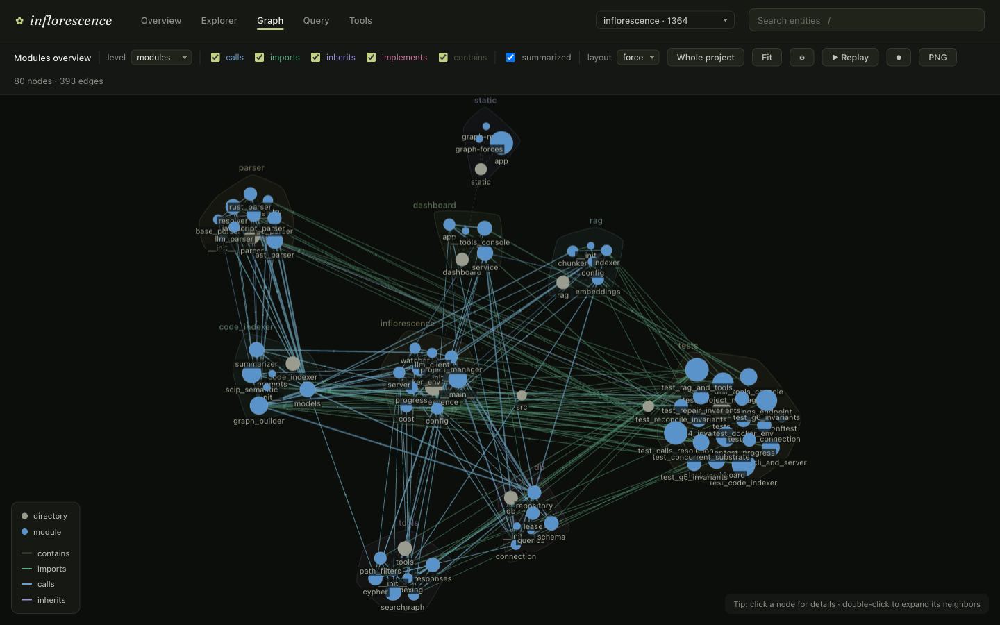
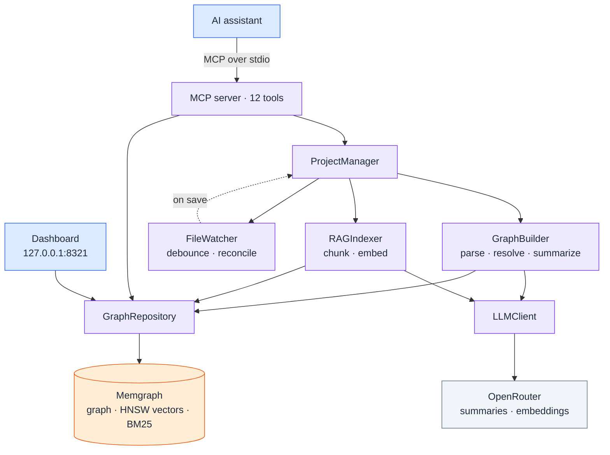
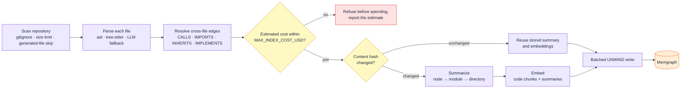
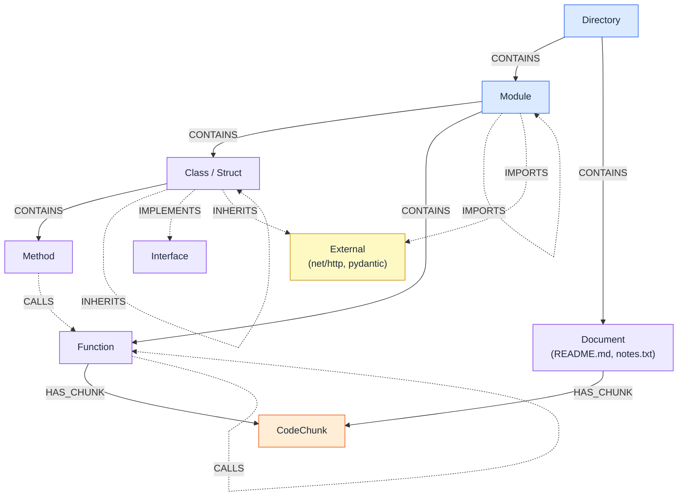
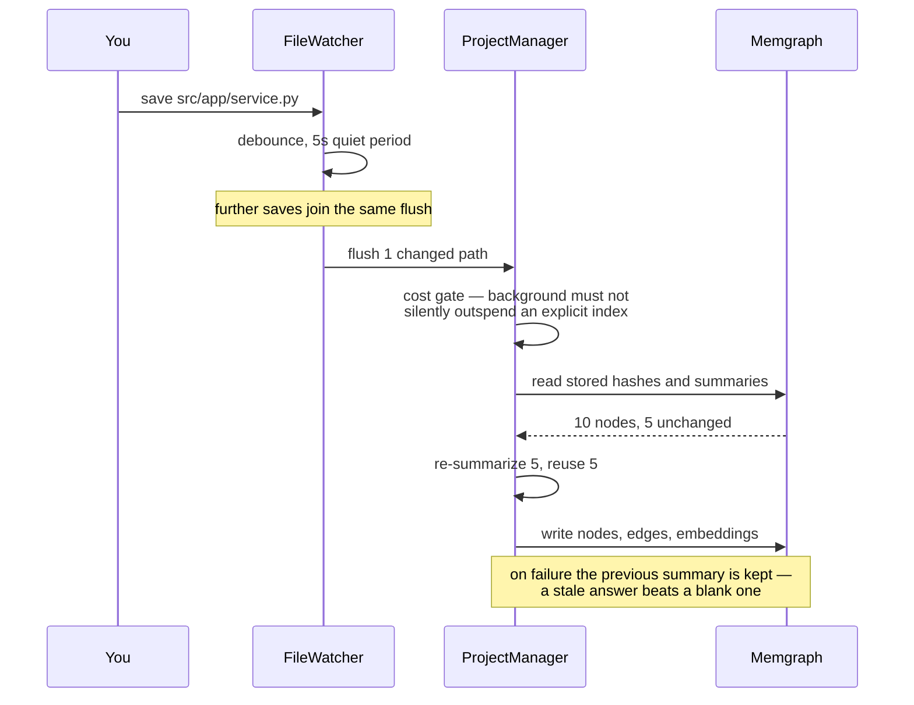
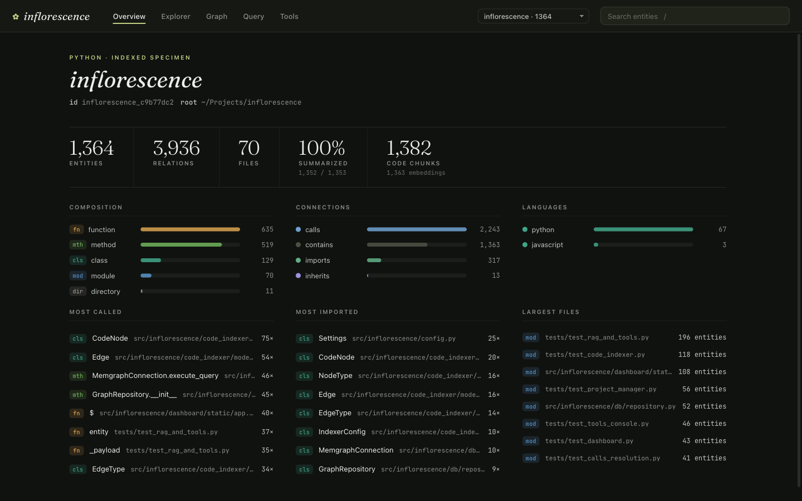
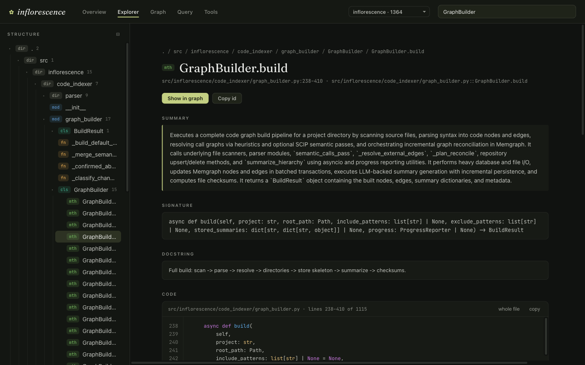
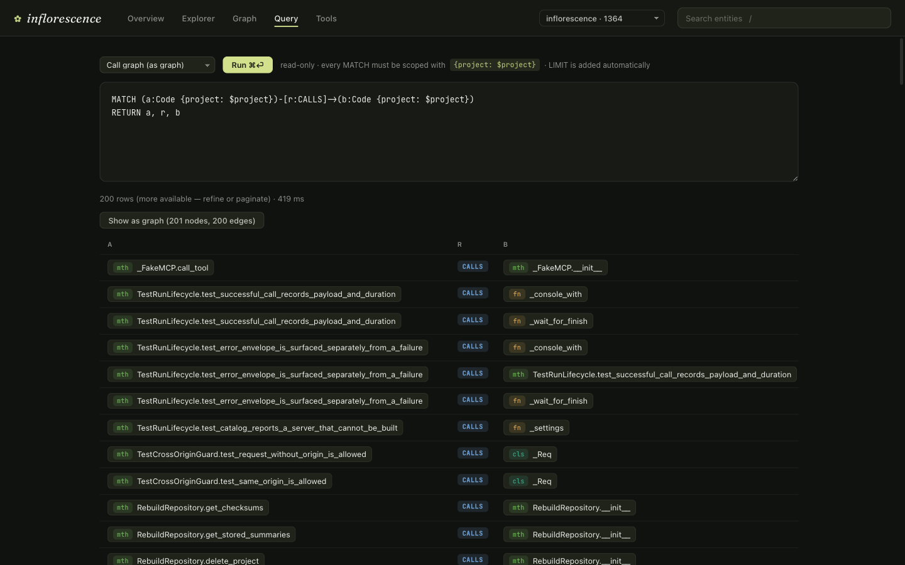
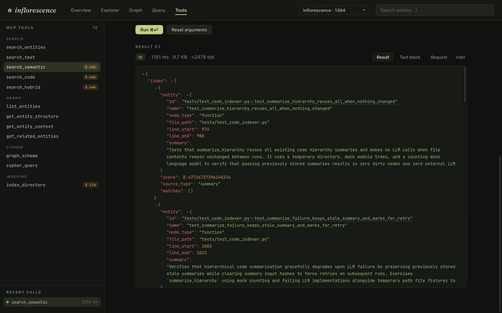
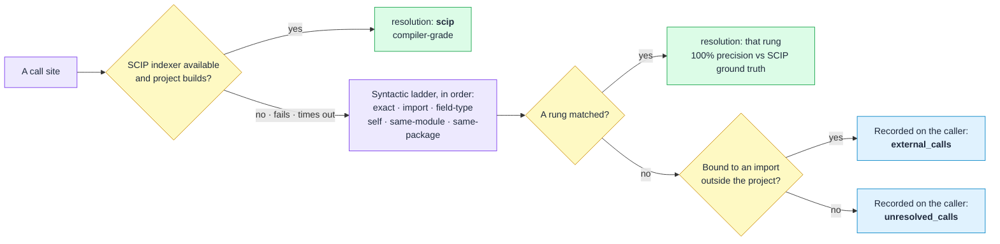

<div align="center">

# Inflorescence

**Deep, structured understanding of any codebase — for your AI assistant.**

An MCP server that turns a repository into a queryable **code graph** (AST → Memgraph),
layers **dual RAG** and **BM25** search on top, and keeps it all **live** as you edit.


[](https://github.com/uiqkos/inflorescence/actions/workflows/ci.yml)

</div>



<div align="center"><sub>Inflorescence indexing itself — 80 modules and the 393 calls, imports and inheritances between them.</sub></div>

---

Most assistants read a codebase one file at a time. **Inflorescence** gives them the whole
shape at once: which function calls which, what a module *does* (not just what it says), and
where a symbol lives — reachable through **12 MCP tools**, a **Cypher** console, and a visual
**dashboard**.

It combines three views of your code, all kept in sync incrementally:

- **A code graph** — modules, classes, functions, methods and their real relationships
  (`CALLS`, `IMPORTS`, `INHERITS`, `IMPLEMENTS`, `CONTAINS`), stored in Memgraph and queryable in Cypher.
  `CALLS` edges carry provenance: compiler-grade resolution via SCIP indexers where the project
  builds, a measured-precision syntactic ladder elsewhere — and calls that can't be resolved are
  recorded on the caller (`external_calls` / `unresolved_calls`) instead of silently dropped.
- **Meaning-based search** — LLM summaries and code chunks embedded into HNSW vector indexes,
  so you can find code by *what it does* even when the wording differs.
- **Exact keyword search** — BM25 full-text indexes over symbol names, signatures, summaries,
  and raw code, for literal identifiers, string literals, and error text.

## Highlights

| | |
|---|---|
| **Multi-language parsing** | Python (stdlib `ast`), JavaScript / TypeScript / Go / Rust (tree-sitter); a Python file that fails to parse falls back to an LLM extractor |
| **Documentation too** | READMEs, design notes and `docs/**.md` are indexed whole — one node per file, body split into overlapping chunks — so the *why* is searchable next to the code |
| **Real relationship graph** | Cross-file call/import/inheritance resolution — not just a symbol dump |
| **Dual RAG** | Code chunks *and* LLM summaries embedded separately, then fused and deduped per entity |
| **3-level summaries** | node → module → directory hierarchical summaries, generated once and reused |
| **Live incremental updates** | a file watcher re-indexes on save; unchanged summaries and embeddings are reused, so an edit costs pennies |
| **Cost guard** | a first-time index is gated by a pre-flight dollar estimate you can cap |
| **Batteries included** | one-command setup (`init`), a health check (`doctor`), and a web dashboard |

## How it works



Indexing walks the repo (honoring `.gitignore` / `.inflorescenceignore`, size limits, and
generated-file skips), parses each file to nodes and edges, resolves cross-file relationships,
generates hierarchical summaries, embeds everything, and writes it to Memgraph in batched
transactions. Re-indexing only re-summarizes and re-embeds what actually changed:



### What the graph looks like



Solid edges are containment — the spine you traverse to browse the tree. Dashed edges are the
real relationships between entities. Every node also carries its signature, docstring, source
range and an embedded summary.

**`Document`** nodes are prose files — `README.md`, `docs/**.md`, `notes.txt`. They sit in the
containment tree beside modules, but they are leaves: a heading is not a symbol and nothing
calls a paragraph, so no structure is invented above them. Their content reaches search as
overlapping chunks of the file body, and their summary is written by a prompt that asks what
the document answers rather than what it calls. Filter them in or out like any other type —
`search_semantic(..., node_types=["document"])`, or `node_types=["function", "method"]` to
exclude them.

**`External`** nodes are the exception: a package the project imports or a base class it
inherits from, which lives outside the indexed tree. They are deliberately *not* labelled
`Code`, so they never appear in entity listings, counts, search or summaries — but they make
the dependency graph traversable:

```cypher
MATCH (:Code {project: $project})-[:IMPORTS]->(e:External {project: $project})
RETURN e.root AS dependency, count(*) AS uses ORDER BY uses DESC
```

## Quick start

**Prerequisites**

- [uv](https://docs.astral.sh/uv/)
- Docker, for Memgraph. It must be the **`memgraph-mage`** image — the vector indexes that
  make semantic search work do not exist on a plain Memgraph build.
- An [OpenRouter](https://openrouter.ai/) API key **with credit on it**. `doctor` checks that a
  key is present, not that it has balance; an exhausted key passes the check and then fails
  every call, leaving you with a graph and no summaries or embeddings.

```bash
# 1. Get the code and its dependencies
git clone https://github.com/uiqkos/inflorescence
cd inflorescence
uv sync

# 2. Start Memgraph (+ Memgraph Lab on http://localhost:3000)
docker compose up -d

# 3. Configure — stores the key, starts Memgraph, registers the MCP server with Claude Code
uv run inflorescence init

# 4. Verify everything is wired up
uv run inflorescence doctor
```

On a fresh install `doctor` reports **three** passes and one failure — the schema is created
by the first index, so it cannot exist yet:

```
[PASS] Config loads: pydantic Settings constructed
[PASS] OPENROUTER_API_KEY: present
[PASS] Memgraph reachable: bolt://localhost:7687
[FAIL] Schema present: core indexes not found — run an index first
```

Index something, and the fourth check goes green:

```bash
uv run inflorescence index /path/to/repo --dry-run   # estimate volume + cost, no writes
uv run inflorescence index /path/to/repo             # build the graph for real
uv run inflorescence doctor                          # now four green checks
```

From then on your assistant can call **`index_directory`** itself.

<details>
<summary>Where the key is stored, and how Memgraph gets started</summary>

`init` writes the key to **`~/.config/inflorescence/.env`** (`%APPDATA%\inflorescence\.env` on
Windows), not to a `.env` beside the directory you ran it from. An MCP client launches the
server with its own working directory, so a project-local key is invisible to the very process
that needs it — that produced a server which started cleanly and then failed every LLM call.
A project `.env` still works and takes precedence when present; real environment variables
outrank both.

Memgraph is started for you. Inside a checkout of this repository `init` uses `docker compose`
(which also brings up Memgraph Lab); anywhere else it starts a standalone container —
`inflorescence-memgraph`, published on loopback only, with its data in a named volume so the
graph survives `docker rm`. `serve` does the same on startup, since an MCP client offers no
moment at which you could have started the database yourself.

To run it by hand instead:

```bash
docker run -d --name inflorescence-memgraph \
  -p 127.0.0.1:7687:7687 \
  -v inflorescence_mg_data:/var/lib/memgraph \
  memgraph/memgraph-mage:latest
```
</details>

> **Installing without a checkout** — `uv tool install git+https://github.com/uiqkos/inflorescence`
> installs the CLI in one line; `uv tool install inflorescence` (PyPI) will follow from the
> first tagged release.

The server runs over stdio and is registered for you by `init`. To run it by hand:

```bash
inflorescence serve                # normal
inflorescence --debug serve        # verbose logs (handler events, update lifecycle)
```

## The 12 MCP tools

**Indexing**
- **`index_directory`** — index or re-index a directory: parse, build the graph, summarize, embed.
  Call with `preview=true` first for a cost estimate. Indexing through the server also starts a
  **file watcher** that keeps the graph in sync as you edit.

**Graph exploration**
- **`list_entities`** — list indexed entities, with pagination and glob path filters
- **`get_entity_structure`** — browse the containment hierarchy under a node, file, or the project root
- **`get_entity_context`** — an entity's parent, children, and incoming/outgoing relations
- **`get_related_entities`** — entities related to a node by a given relationship
- **`search_entities`** — find entities by name substring

**Search**
- **`search_code`** — vector similarity over raw source-code chunks
- **`search_semantic`** — vector search by *meaning* over summaries (find code by what it does)
- **`search_hybrid`** — combined code + summary vector search, deduplicated per entity
- **`search_text`** — exact keyword (BM25) search over names, signatures, summaries, and raw code

**Direct query**
- **`cypher_query`** — run paginated, read-only Cypher against Memgraph (each `MATCH` is project-scoped)
- **`graph_schema`** — describe the graph (labels, node types, relationship types, property keys,
  named indexes, query rules) so you can write Cypher without guessing

## Live incremental updates

Index a project through the server and Inflorescence watches it. On save, the watcher debounces
the change, then reconciles the graph — new functions appear, deleted ones are removed, changed
signatures update, and cross-file edges are re-resolved. Summaries and embeddings for **unchanged**
nodes are reused, so a one-file edit re-summarizes only that file's path to the root, not the whole
project.



Run with `--debug` to watch the events flow:

```
Observed modified event for project=…: src/app/service.py (1 path(s) pending flush)
Flushing 1 changed file(s) for project=…
Applying watcher update for project=…: 1 changed path(s) under /path/to/repo
Detected 1 changed and 0 deleted file(s); rebuilding project
Summarization complete: 10 nodes, 5 regenerated, 5 reused
```

## Dashboard

A local web UI for exploring indexed graphs:

```bash
inflorescence dashboard                       # opens http://127.0.0.1:8321
inflorescence dashboard --port 9000 --no-browser
```

Five views, switchable per project. Every screenshot below is Inflorescence indexing its own
source — 1,364 entities across 70 files.

**Overview** — entity and relation counts, type breakdowns, summary coverage, most-called and
most-imported entities, largest files.



**Explorer** — the containment tree with hierarchical summaries; per-entity pages with summary,
signature, docstring, source, and clickable relations.



**Query** — a read-only Cypher console with presets; node results render as a graph.



**Graph** — an interactive force-directed graph, shown at the top of this page: whole-project
module overview or the neighborhood of any entity; edge direction shown by animated particles;
filter by relation type, expand by double-click, export PNG. **Replay** lights the graph up in
build order — root directory, then files, then the code inside them, with calls and imports
fading in as their endpoints land. Purely cosmetic: nodes are revealed in the position they
already settled into, so the layout never moves and the camera never chases it. It reads
nothing, writes nothing, and leaves the graph exactly as it was.

**Tools** — the MCP surface, callable by hand. Every tool the server hands an agent is listed
with its real description; picking one builds a form from its JSON schema (required fields
marked, defaults shown, `directory` pre-filled with the project's indexed path). Run it and the
panel shows what the agent gets: the parsed payload in a foldable JSON viewer, the raw text
block byte for byte, the argument object that was sent, plus duration, payload size and an
approximate token count. Entity ids in a result link straight into the Explorer. Recent calls
are kept, so you can click one and re-run it with a single value changed.



Calls run in the background on their own event loop: a long `index_directory` survives a page
reload, keeps the rest of the dashboard responsive, and can be cancelled (cancellation lands at
the tool's next await, so a blocking filesystem scan may still finish). The two money-spending
paths are explicit — tools that call an embedding or LLM API are labelled in the list, and
`index_directory` with `preview=false` is refused by the API unless the confirmation checkbox
was ticked. Indexing from here deliberately starts no file watcher: the MCP server owns that.

## Configuration

All settings are environment variables (or a `.env` file). The ones you are likely to touch:

| Variable | Default | Description |
|---|---|---|
| `OPENROUTER_API_KEY` | — | OpenRouter API key (**required**) |
| `MEMGRAPH_URL` | `bolt://localhost:7687` | Memgraph connection URL |
| `MEMGRAPH_USER` / `MEMGRAPH_PASSWORD` | — | Optional Memgraph auth |
| `LLM_MODEL` | `google/gemini-2.5-flash-lite` | Model for summaries and LLM parsing |
| `CODE_EMBEDDING_MODEL` | `openai/text-embedding-3-small` | Code-chunk embeddings |
| `SUMMARY_EMBEDDING_MODEL` | `openai/text-embedding-3-small` | Summary embeddings |
| `USE_LLM_SUMMARIES` | `true` | Set `false` for a graph-only index that sends nothing to an LLM |
| `INDEX_DOCUMENTS` | `true` | Index prose files (`.md`, `.txt`, …) as whole documents. `false` leaves them out of the scan entirely |
| `MAX_FILE_SIZE_BYTES` | `262144` | Skip files larger than this |
| `MAX_INDEX_COST_USD` | `10.0` | Cost cap on a first index **and** on every watcher update. Set empty to remove the cap |
| `REQUIRE_SEARCH_INDEXES` | `true` | Refuse to index against a Memgraph that cannot host vector indexes, instead of paying for unsearchable embeddings |
| `USE_SCIP_SEMANTIC` | `true` | Use SCIP indexers for call resolution — see [below](#optional-compiler-grade-call-resolution) |
| `WATCHER_DEBOUNCE_SECONDS` | `5.0` | Debounce window before a change flush |
| `LOG_LEVEL` | `INFO` | Root log level. `--debug` overrides it |

`MAX_INDEX_COST_USD` is a cap, not a budget: an index whose *estimate* exceeds it is refused
before any money is spent, and the CLI reports the estimate so you can raise the cap
deliberately. The estimate uses the price settings in `.env.example`, which match the default
models — switch models and you should update the prices too, or the cap will be measuring the
wrong thing.

**[`.env.example`](.env.example) is the complete reference** — every setting, with its default
and what it is for. The table above is a subset.

Logs go to a per-user location (`~/Library/Logs/inflorescence/` on macOS,
`$XDG_STATE_HOME/inflorescence/` on Linux, `%LOCALAPPDATA%\inflorescence\` on Windows), capped
at 10 MB per file with 3 rotations. Override with `--log-file`.

## What leaves your machine

Indexing sends your source code to third-party APIs. Specifically:

- **To the LLM** (OpenRouter by default): the source of each entity, truncated to
  `SUMMARY_MAX_SOURCE_CHARS` (12 000 characters), for summarization — and the whole file for
  any Python file the AST parser cannot handle, which falls back to an LLM extractor.
- **To the embeddings endpoint**: every code chunk and every generated summary.

Nothing else is transmitted: no paths outside the indexed repository, no telemetry, no
analytics. The graph, the vectors, and the dashboard are entirely local.

If that is not acceptable for a given repository, `USE_LLM_SUMMARIES=false` builds the code
graph and skips summarization — but code-chunk embeddings still reach the embeddings endpoint,
so a fully offline index means pointing `CODE_EMBEDDING_BASE_URL` at a local
OpenAI-compatible server.

## MCP client configuration

The easiest path is `inflorescence init`, which detects Claude Code and runs `claude mcp add` for
you (or prints a ready-to-paste Claude Desktop snippet otherwise).

`uv tool install` places the `inflorescence` script in uv's tool-bin directory, which may not be on
your MCP client's `PATH`. To avoid "command not found", use the **absolute path** to the installed
script (find it with `which inflorescence`):

```json
{
  "mcpServers": {
    "inflorescence": {
      "command": "/absolute/path/to/inflorescence",
      "args": ["serve"],
      "env": { "OPENROUTER_API_KEY": "your_key_here" }
    }
  }
}
```

The `env` block is belt-and-braces. Since the key lives in `~/.config/inflorescence/.env`, the
server finds it whatever working directory the client launches it from, and the block can be
omitted — it is worth keeping only if you want a different key for this one client.

## Optional: compiler-grade call resolution

`CALLS` edges are resolved by a ladder. The top rung uses [SCIP](https://sourcegraph.com/docs/code-search/code-navigation/explanations/scip)
indexers — the same machinery Sourcegraph uses — which resolve calls the way a compiler does
rather than by matching names.

**You do not install them.** If Docker is available, the indexer runs in a container that
already carries the toolchain it needs, with the repository mounted **read-only**:

| Language | Indexer | Version | Image | Installed by hand instead |
|---|---|---|---|---|
| Go | `scip-go` | 0.2.7 | `inflorescence-scip-go` | `go install github.com/scip-code/scip-go/cmd/scip-go@v0.2.7` |
| Python | `scip-python` | 0.6.6 | `inflorescence-scip-node` | `npm install -g @sourcegraph/scip-python@0.6.6` |
| TypeScript / JavaScript | `scip-typescript` | 0.4.0 | `inflorescence-scip-node` | `npm install -g @sourcegraph/scip-typescript@0.4.0` |

The versions are pinned in the Dockerfiles, so a rebuild of the same Dockerfile installs the
same indexers — that is what makes "build the image yourself" (below) a meaningful
alternative to pulling ours.

A binary already on `PATH` wins — it is faster, with no container to start. `SCIP_RUNNER`
pins one rung (`auto`, the default, `native`, or `docker`); `SCIP_IMAGES` overrides an image.
The two images are split by toolchain, not by language: neither indexer is a standalone
binary — `scip-go` drives `go list` and both of the others are Node programs — so indexing a
Python repository pulls the Node image and never a Go toolchain.

Containerizing this rung is not only about setup. A SCIP indexer necessarily executes the
**indexed project's own build configuration**, which is exactly the code you have least
reason to trust when you point this tool at someone else's repository to read it. In the
container it sees one read-only mount and nothing else of your machine.

### Three ways to run this rung — pick your trust level

Pulling a container image from a stranger's personal namespace is a fair thing to hesitate
over. All three paths below are first-class; nothing degrades except as documented.

1. **Build the images yourself.**

   ```bash
   inflorescence build-images
   ```

   The Dockerfiles ship inside the package (readable in
   [`src/inflorescence/docker/`](src/inflorescence/docker)), with the indexer versions
   pinned — a rebuild installs the same tools, versions in the table above. The command
   tags the result with exactly the references the docker rung looks for, and `docker run`
   uses a locally present tag without contacting any registry — after building, no pull
   ever happens. To be precise about what "local" means: the *build* itself still
   downloads — the base image from Docker Hub, `scip-go` sources via proxy.golang.org, the
   two npm indexers from npm — but every ingredient is named in a recipe you can read,
   instead of arriving as one opaque blob.

2. **Pull the published images and check who built them.** They are built multi-arch and
   pushed by [CI](.github/workflows/images.yml) from a visible commit of this repository —
   not from anyone's laptop — and carry GitHub artifact attestations (Sigstore under the
   hood). Verify before first use:

   ```bash
   gh attestation verify oci://ghcr.io/uiqkos/inflorescence-scip-go:v1 --owner uiqkos
   gh attestation verify oci://ghcr.io/uiqkos/inflorescence-scip-node:v1 --owner uiqkos
   ```

   The code references these images by immutable digest, not by tag: a tag can be silently
   re-pointed in the registry, a digest cannot. `inflorescence doctor` prints the exact
   reference that will run on your machine and whether it is already local.

3. **Turn the rung off.**

   ```bash
   USE_SCIP_SEMANTIC=false
   ```

   No containers start at all. `CALLS` edges come from the syntactic ladder — 100%
   precision in our measurements, with recall of 84.5% on Go and 66% on Python — and
   everything it cannot resolve is recorded honestly in `external_calls` /
   `unresolved_calls` rather than guessed.

Worth stating plainly: the alternative to the container is not "everything stays local" —
it is `go install` / `npm install -g` of the same third-party indexer **with no sandbox at
all**, and an indexer, wherever it runs, executes the build configuration of the repository
being indexed. The container is the contained option: repository mounted read-only, index
written to a separate mount, `--rm`, your uid, and nothing else of the host exposed
(`docker_scip_argv` in
[`scip_semantic.py`](src/inflorescence/code_indexer/scip_semantic.py)).

Sizes, measured: scip-go — 243 MB on disk, 76 MB of network transfer; scip-node — 310 MB
and 100 MB. Two images rather than one because a merged image would cost ~545 MB and
~170 MB of transfer for *everyone*, including a user who only ever indexes Python; only a
polyglot repository would come out ahead, and then by about 6 MB. (A future Rust indexer
would push a unified image past a gigabyte.)

None of this is required. A missing indexer, a project that does not build, or a timeout
degrades that language to the syntactic ladder — the index still succeeds, and every `CALLS`
edge records which rung resolved it in its `resolution` property, so you can always tell
compiler-grade edges from heuristic ones. `inflorescence doctor` reports which rung each
language would use before you spend anything.



What cannot be resolved is **recorded, not guessed**. There is deliberately no
"globally unique short name" fallback — it measured 39% precision — and no
`candidates[0]` pick, because a wrong edge is worse than an honest gap: an agent that trusts
a fabricated call graph reasons confidently to the wrong conclusion. So a node with zero
outgoing `CALLS` edges and empty `external_calls` / `unresolved_calls` genuinely calls nothing.

The design, the per-rung precision measurements and the known limits are written up in
[docs/calls-resolution.md](docs/calls-resolution.md).

> **Indexing untrusted code?** The SCIP pass runs a real build toolchain *inside* the
> repository being indexed, which reads that repository's build configuration. Set
> `USE_SCIP_SEMANTIC=false` for code you have not reviewed.

## Supported languages

| Language | Parser |
|---|---|
| Python | stdlib `ast` — with an LLM fallback if a file fails to parse |
| JavaScript / TypeScript | tree-sitter |
| Go | tree-sitter |
| Rust | tree-sitter |
| Prose documents | `.md`, `.markdown`, `.mdx`, `.rst`, `.txt`, `.text`, `.adoc`, `.asciidoc`, `.org` — indexed whole, not parsed |

Only these extensions are scanned; files in other languages are skipped today. The
parser layer is pluggable (`ParserRegistry` maps an extension to a parser), so broad
tree-sitter coverage is a natural next step — see the note below.

Documents are deliberately *not* parsed for structure: each file becomes one `Document`
node and its body is split into overlapping windows (`DOCUMENT_CHUNK_SIZE` /
`DOCUMENT_CHUNK_OVERLAP`), which is what keeps a passage in the middle of a long guide
retrievable. They are summarized and embedded like code, so they cost money like code —
set `INDEX_DOCUMENTS=false` to leave them out entirely, or narrow `DOCUMENT_EXTENSIONS`.

## Development

```bash
git clone https://github.com/uiqkos/inflorescence
cd inflorescence
uv sync --extra dev
uv run pytest                  # test suite
uv run ruff check src/ tests/  # lint
```

The test suite needs **nothing running** — no Memgraph, no API key, no network. Tests that
require a live database skip themselves unless `INFLORESCENCE_TEST_MEMGRAPH_URL` is set, so a
clean clone gives you a green run in seconds. To include them:

```bash
docker compose up -d           # Memgraph + Lab
INFLORESCENCE_TEST_MEMGRAPH_URL=bolt://localhost:7687 uv run pytest
```

What unit tests cannot check cheaply — that the tools return real payloads against a live
stack, and that editing one file does not re-summarize the project — is a manual gate in
[docs/smoke-test.md](docs/smoke-test.md).

## Design invariants

An index is a derivative of your code that costs real money and real time to produce, lives
a long time, and should update cheaply. Ten rules protect that, and every one of them is the
residue of a production incident rather than an abstraction. Comments in `src/` and `tests/`
cite them as `INV-1` … `INV-10`; this is the key.

- **INV-1 · Paid-for data is never destroyed** — An update *reconciles* (upsert what is live,
  delete only what is genuinely stale) instead of wiping and rebuilding, so nothing stored is
  removed before its replacement is actually written. A failed run degrades to *stale* data,
  never to *empty*: updates once began with a project-wide delete, so a crashed run left the
  project with no chunks and no embeddings.
- **INV-2 · Fail closed — no mutation without working dependencies** — If the LLM, an
  embedding endpoint, or the database is unreachable or a key is invalid, a cheap pre-flight
  aborts *before* the first write instead of discovering it at node 800; a server with a
  broken configuration stays read-only. A keyless server once "indexed" happily, took a 401
  on every call, and wrote the results of those failures into the graph.
- **INV-3 · Stale beats empty** — On partial failure the previous value is kept together with
  a marker to recompute on the next run; good data is never overwritten with a fallback or a
  blank. A summarization failure once wrote `summary=""` over 876 perfectly good summaries.
- **INV-4 · One mutation per project at a time** — Concurrent updates to the same project are
  impossible by construction (a lock), not by lucky timing, and re-running the same update is
  a cheap no-op thanks to checksums. Two watcher flushes racing each other once erased each
  other's writes, reporting "1660 re-embedded, stored 0".
- **INV-5 · Cost is proportional to the change** — Editing one file costs O(file), not
  O(project): summaries are reused by content hash, chunk ids are content-derived and stable,
  and no-op events are discarded before any work starts. A full recompute happens only on an
  explicit request, and a re-run with no changes must cost zero API calls — deleting a single
  file once triggered a re-embed of the entire project.
- **INV-6 · Only indexable paths affect the index** — Events for paths that were never in the
  index (temp files, gitignored paths, unsupported extensions) are filtered out as early as
  possible and cannot start work, and "absent from the scan" is never read as "deleted" —
  only something that really was indexed can be deleted. Saving an ignored file was once
  classified as a deletion and triggered a full rebuild, looping on phantom
  `0 changed, N deleted`.
- **INV-7 · Telemetry tells the truth about the database** — "Stored N" means N rows in the
  database as counted by the write, not N rows submitted; attempts and successes are counted
  separately, a mass failure logs at ERROR rather than INFO, and an operation's result
  reports actual post-run state. A run once reported "828 re-embedded" with zero rows
  actually written, and nothing above WARNING revealed it.
- **INV-8 · Any corruption heals on the next run** — Every incomplete state (an empty
  summary, a NULL embedding, a file with no chunks, a blank input hash) is detectable by a
  query and repaired by the next healthy run, with no rebuild and no manual surgery, so a run
  killed at any point leaves state that repair converges from. Verified in practice: 876
  summaries, 1448 chunks and 1704 embeddings all came back from a single `index`.
- **INV-9 · Project filter before limit** — One database holds many projects, so every global
  query (vector search, BM25) applies project scope before or around top-k, or over-fetches
  and trims after filtering; one project can never evict another's results. Vector search
  once took a global top-k and filtered afterwards, returning zero hits for a project whose
  neighbour had filled the whole top-k.
- **INV-10 · The user's money is spent deliberately** — A first index is gated by a cost
  estimate, and a background operation may never silently spend more than an explicit one.
  Paying twice for what is already paid for — re-embedding unchanged content — is a bug by
  definition: each phantom rebuild once re-paid for 1448 chunk embeddings and threw the
  result away.

## License

[MIT](LICENSE) © 2026 Kirill
